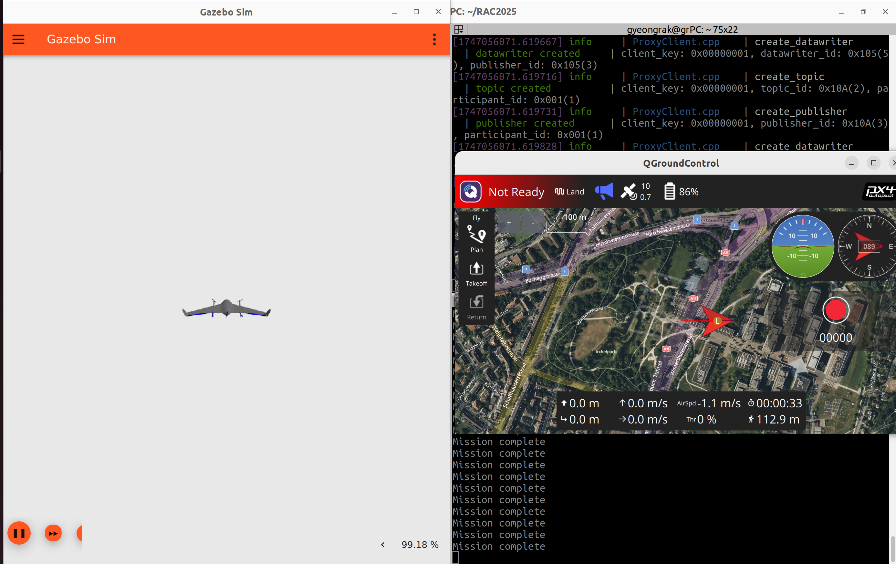

# RAC2025
Robot Aircraft Competition 2025

## Environment
Ubuntu 22.04
ROS2 Humble
PX4_Autopilot: v1.15.4
px4_msgs: main

gazebo는 나는 fortress 버전 쓰긴 했는데 classic도 될거임 아마.

## Installation
'''
git clone https://github.com/Bulnabi-SNU/RAC2025.git
cd RAC2025
colcon build --symlink-install
'''

## How to Use

Terminal 1 : PX4 SITL
'''
cd PX4-Autopilot
make px4_sitl gz_standard_vtol
'''

Terminal 2 : Micro-XRCE-DDS
'''
MicroXRCEAgent udp4 -p 8888
'''

Terminal 3 : Q Ground Control
'''
./QGroundControl.AppImage
'''

Terminal 3 : Q Ground Control
'''
cd RAC2025
rosfoxy # alias
ros2 run vehicle_controller vehicle_controller
'''
